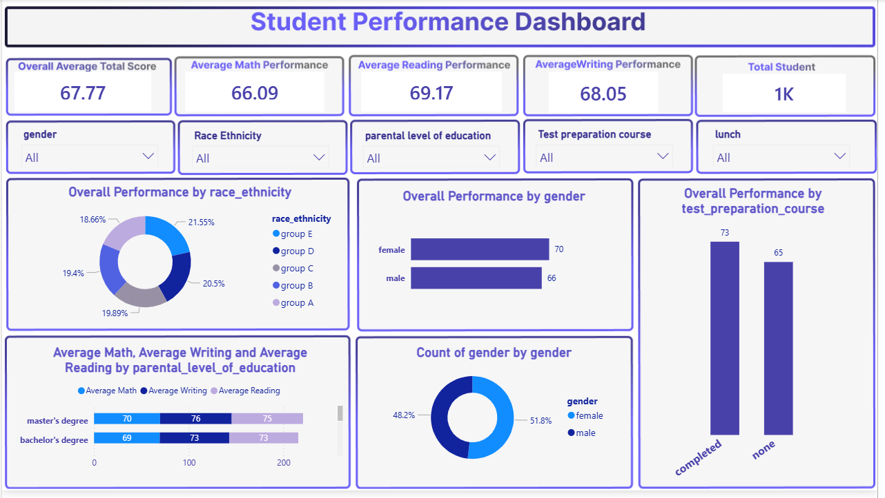

# Student Performance Dashboard

Interactive Student Performance Dashboard 📚 | Power BI

## 📌 Project Overview

This project is an interactive Power BI dashboard designed to analyze student academic performance using different demographic and educational factors. It helps identify trends in student achievement and supports data-driven educational insights.

## 🎯 Objectives

- Analyze students' academic performance.
- Compare Math, Reading, and Writing scores.
- Explore the impact of gender, race/ethnicity, parental education, lunch type, and test preparation.
- Build an interactive dashboard using Power BI.

## 📊 Dashboard Features

- Overall Average Score KPI
- Average Math Score
- Average Reading Score
- Average Writing Score
- Student Count
- Performance by Gender
- Performance by Race/Ethnicity
- Performance by Test Preparation
- Performance by Parents' Education
- Interactive slicers

## 🛠 Tools Used

- Power BI
- Power Query
- DAX
- Data Modeling

